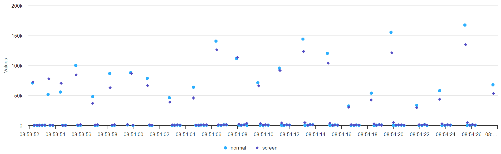
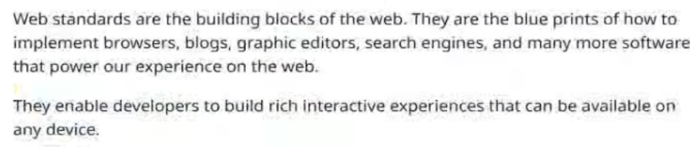
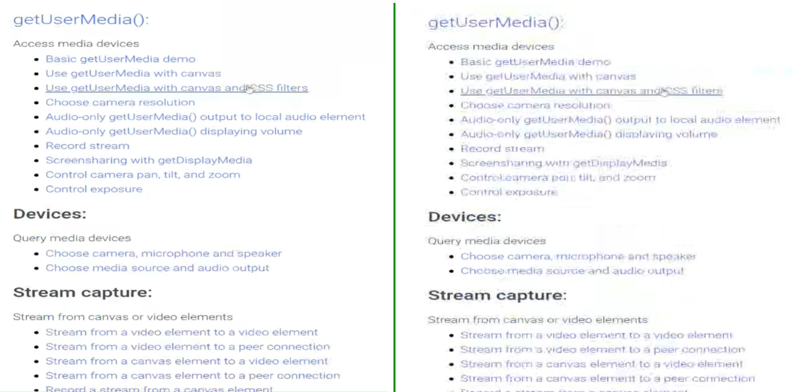

# WebCodecs AV1 screen content coding tools

## Authors:

- [Philipp Hancke](https://github.com/fippo)
- [Bernard Aboba](https://github.com/@aboba)

## Introduction

The AV1 video codec includes some tools for optimizing the encoding of "screen content" described in [section 3.8 of this document](https://aomedia.org/docs/AV1_ToolDescription_v11-clean.pdf)
This allows an application to encode “screen content”, in particular presentation slides, in a more efficient way supported by the AV1 codec.

This material is typically static, often includes text, a limited set of colors, lots of repetitive content (e.g. straight lines, shapes) for which the encoder can optimize
which leads to a lower bitrate, less artifacts and reduced blurriness as shown below.

## Goals

Allow WebCodecs to leverage the same AV1 encoder capabilities already used by some WebRTC libraries and enabled by default for MediaStreams originating from screen capture.
## Code sample

```js
  encoder.configure({
    codec: 'av01.0.04M.08',
    av1: { forceScreenContentTools: true },
    width: 1920,
    height: 1080,
    bitrate: 2_000_000,
    framerate: 5,
  });
```

## Comparison
Like with most video encoding features, the results depend on a number of factors such as the target bitrate as well as the input.
Since WebCodecs allows turning this on per-encoder it is possible to run A/B comparisons easily.
Note: reproduding the fiddle results currently requires a [patched version of Chromium](https://chromium-review.googlesource.com/c/chromium/src/+/4672796).

### Reduced frame size
[jsfiddle used](https://jsfiddle.net/fippo/r392ohwz/23/)

We compare the frame size when using screen content coding tools ("screen") to the stock result (normal)
for a given target and frame rate. This is done while slowly paging through a slide deck where the content changes only every few seconds:


The graph shows the size of each encoded frame (y) over the frame number (x).
The slide changes cause large spikes in bitrate compared to the very small frames before.
This is problematic in use-cases such as video conferencing that need to estimate and allocate a bandwidth budget to the encoded frames.
Enabling screen content coding tools lead to a reduced frame size (i.e. smaller spikes) and an overall bitrate reduction by ~10%.

(Note that the initial few delta frames are slightly larger)

### Encoding of text
[jsfiddle used](https://jsfiddle.net/fippo/r392ohwz/23/)
The impact of screen content coding tools is also quite visible when a website containing a lot of text is captured at a low bitrate (100kbps):

The screen content coding tools enabled encoder produces sharper and more readable text. Zooming in shows a lot of artifacts when not using
screen content coding tools:


### Reduced blurriness when scrolling
Scrolling a website containing a lot of text with the same setup as before shows a significant difference as well.
In a  screenshot one can see similar results as before:

This video of a screen capture (using a different codec but at higher bitrate to reduce artifacts) shows that using screen content coding
tools make a big difference in how "blurry" the result looks:

